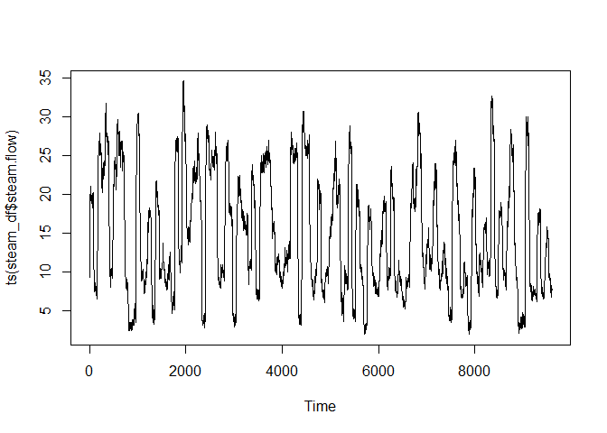
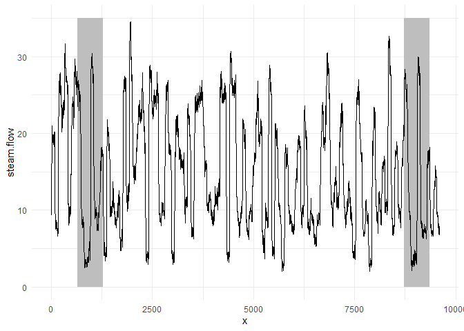
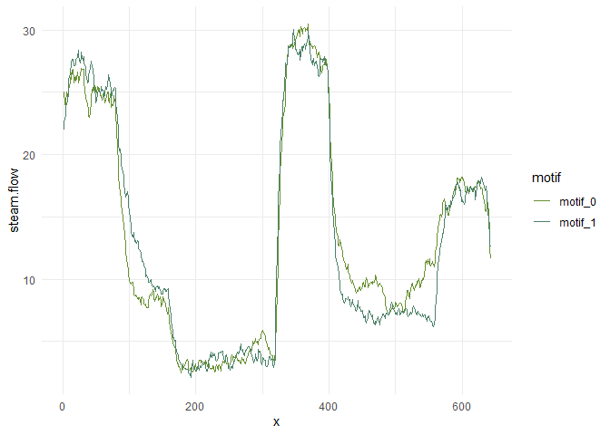
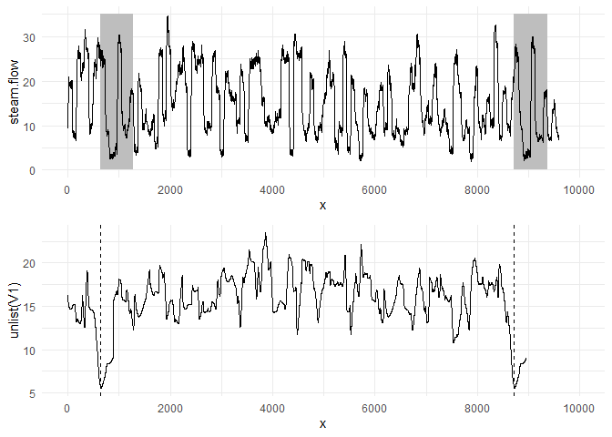
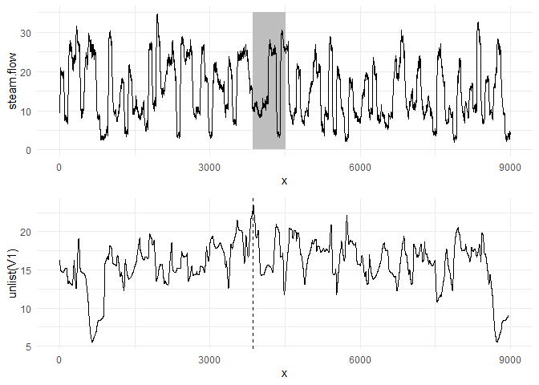

# stumpyr
fth

## STUMPY Tutorial in R

### ‘stumpyr’

this is not a direct port of the STUMPY Python library to an R package,
instead showcases how-to setup Python modules in R with use of the
reticulate library.

installation of stumpy using reticulate:

``` r
library(reticulate)

# py_install("stumpy", pip = TRUE)
```

##### this tutorial is based on the python example here:

##### https://stumpy.readthedocs.io/en/latest/Tutorial_STUMPY_Basics.html

### What is a Motif?

Time series motifs are approximately repeated subsequences found within
a longer time series. Being able to say that a subsequence is
“approximately repeated” requires that you be able to compare
subsequences to each other. In the case of STUMPY, all subsequences
within a time series can be compared by computing the pairwise
z-normalized Euclidean distances and then storing only the index to its
nearest neighbor. This nearest neighbor distance vector is referred to
as the matrix profile and the index to each nearest neighbor within the
time series is referred to as the matrix profile index. Luckily, the
stump function takes in any time series (with floating point values) and
computes the matrix profile along with the matrix profile indices and,
in turn, one can immediately find time series motifs. Let’s look at an
example:

### Loading the Steamgen Dataset:

This data was generated using fuzzy models applied to mimic a steam
generator at the Abbott Power Plant in Champaign, IL. The data feature
that we are interested in is the output steam flow telemetry that has
units of kg/s and the data is “sampled” every three seconds with a total
of 9,600 datapoints.

``` r
steam_df <- read.csv("https://zenodo.org/record/4273921/files/STUMPY_Basics_steamgen.csv?download=1")
steam_df |> head()
```

      drum.pressure excess.oxygen water.level steam.flow
    1      320.0824    2.50677390   0.0327013   9.302970
    2      321.7110    2.54590790   0.2847994   9.662621
    3      320.9133    2.36056150   0.2036516  10.990955
    4      325.0025    0.02705418   0.3261869  12.430107
    5      326.6528    0.28564943   0.7537763  13.681666
    6      326.1869    2.63132810   1.8518541  14.608886

### visualizing the streamgen dataset in base R:

``` r
steam_df$steam.flow |> ts() |> plot()
```



Take a moment and carefully examine the plot above with your naked eye.
If you were told that there was a pattern that was approximately
repeated, can you spot it? Even for a computer, this can be very
challenging. Here’s what you should be looking for:

visualizing the motif again with dplyr + ggplot2:

``` r
library(ggplot2)
library(dplyr)
```


    Attaching package: 'dplyr'

    The following objects are masked from 'package:stats':

        filter, lag

    The following objects are masked from 'package:base':

        intersect, setdiff, setequal, union

``` r
library(BobRossColors)

m <- 643

steam_df |>
  mutate(
    x = row_number()
  ) |>
  ggplot() + 
  geom_rect(aes(xmin = 643,  xmax = 643  + m, ymin = 0, ymax = 35), fill = 'grey') + 
  geom_rect(aes(xmin = 8724, xmax = 8724 + m, ymin = 0, ymax = 35), fill = 'grey') +
  geom_line(aes(x = x, y = steam.flow)) + 
  theme_minimal()
```



overlaying the sequences:

``` r
motif_0 <- seq(643,  length.out = m)
motif_1 <- seq(8724, length.out = m)

steam_df |>
  mutate(
    x = row_number()
  ) |>
  filter(x %in% c(motif_0, motif_1)) |>
  mutate(
    motif = c(rep("motif_0", m), rep("motif_1", m))
  ) |>
  group_by(motif) |>
  mutate(
    x = row_number()
  ) |> 
  ggplot() +
  geom_line(aes(x = x, y = steam.flow, color = motif)) + 
  theme_minimal() + 
  BobRossColors::scale_color_bob_ross(painting = "meadow_lake", type = "qualitative")
```



The motif (pattern) that we are looking for is highlighted above and yet
it is still very hard to be certain that the orange and green
subsequences are a match (upper panel), that is, until we zoom in on
them and overlay the subsequences on top each other (lower panel). Now,
we can clearly see that the motif is very similar! The fundamental value
of computing the matrix profile is that it not only allows you to
quickly find motifs but it also identifies the nearest neighbor for all
subsequences within your time series. Note that we haven’t actually done
anything special here to locate the motif except that we grab the
locations from the original paper and plotted them. Now, let’s take our
steamgen data and apply the stump function to it:

## Find a Motif Using STUMP

import python library into R environment

``` r
stumpyr <- reticulate::import("stumpy")
```

access the underlying STUMPY submodules with use of the dollar sign,
\$  
this takes place of the . in python examples.

\$ is typical base R behavior, one can extract a column from a df with
the same method (seen below):

``` r
# my experience with other python/r ports, 
# params need to be set to int, R defaults to float/numeric, 
# use as.integer() to set type

m  <- as.integer(640)

mp <- stumpyr$stump(steam_df$steam.flow, m)
```

stump requires two parameters:

1)  A time series

2)  A window size, m

In this case, based on some domain expertise, we’ve chosen m = 640,
which is roughly equivalent to half-hour windows. And, again, the output
of stump is an array that contains all of the matrix profile values
(i.e., z-normalized Euclidean distance to your nearest neighbor) and
matrix profile indices in the first and second columns, respectively
(we’ll ignore the third and fourth columns for now). To identify the
index location of the motif we’ll need to find the index location where
the matrix profile, mp\[:, 0\], has the smallest value:

``` r
# mp |> ts() |> plot()
# mp |> as.data.frame()
# mp |> as.data.frame() |> str() # interesting, each value is a list object

# motif_idx = np.argsort(mp[, 0])[0] 
motif_idx <- mp[, 1] |> unlist() |> order() |> head(1)

paste0("The motif is located at index ", motif_idx)
```

    [1] "The motif is located at index 644"

With this motif_idx information, we can also identify the location of
its nearest neighbor by cross-referencing the matrix profile indices

``` r
nearest_neighbor_idx <- mp[motif_idx, 2] |> unlist()

paste0("The nearest neighbor is located at index ", nearest_neighbor_idx)
```

    [1] "The nearest neighbor is located at index 8724"

Now, let’s put all of this together and plot the matrix profile next to
our raw data:

``` r
gridExtra::grid.arrange(
steam_df |>
  mutate(
    x = row_number()
  ) |>
  ggplot() +
  geom_rect(aes(xmin = motif_idx,  
                xmax = 643  + motif_idx, 
                ymin = 0, ymax = 35), fill = 'grey') +
  geom_rect(aes(xmin = nearest_neighbor_idx,  
                xmax = 643  + nearest_neighbor_idx, 
                ymin = 0, ymax = 35), fill = 'grey') +
  geom_line(aes(x = x, y = steam.flow)) +
  scale_x_continuous(breaks = seq(from = 0, to = 10000, by = 2000), limits = c(0,10000)) + 
  theme_minimal(),

mp |> 
  as.data.frame() |> 
  mutate(x = row_number()) |>
  ggplot() +
  geom_line(aes(x = x, y = unlist(V1))) + 
  geom_vline(aes(xintercept = motif_idx), linetype = 2) + 
  geom_vline(aes(xintercept = nearest_neighbor_idx), linetype = 2) + 
  scale_x_continuous(breaks = seq(from = 0, to = 10000, by = 2000), limits = c(0,10000)) + 
  theme_minimal()
)
```



What we learn is that the global minima (vertical dashed lines) from the
matrix profile correspond to the locations of the two subsequences that
make up the motif pair! And the exact z-normalized Euclidean distance
between these two subsequences is:

``` r
mp[motif_idx, 1] |> unlist()
```

    [1] 5.49162

So, this distance isn’t zero since we saw that the two subsequences
aren’t an identical match but, relative to the rest of the matrix
profile (i.e., compared to either the mean or median matrix profile
values), we can understand that this motif is a significantly good
match.

## Find Potential Anomalies (Discords) using STUMP

Conversely, the index location within our matrix profile that has the
largest value (computed from stump above) is:

``` r
# discord_idx = np.argsort(mp[:, 0])[-1]

discord_idx <- mp[, 1] |> unlist() |> order() |> tail(1)

paste0("The discord is located at index ", discord_idx)
```

    [1] "The discord is located at index 3865"

And the nearest neighbor to this discord has a distance that is quite
far away:

``` r
nearest_neighbor_distance = mp[discord_idx, 1] |> unlist()

paste0("The nearest neighbor subsequence to this discord is ", nearest_neighbor_distance, " units away")
```

    [1] "The nearest neighbor subsequence to this discord is 23.476168367302 units away"

The subsequence located at this global maximum is also referred to as a
discord, novelty, or “potential anomaly”:

``` r
gridExtra::grid.arrange(
steam_df |>
  mutate(
    x = row_number()
  ) |>
  ggplot() +
  geom_rect(aes(xmin = discord_idx,  xmax = 643  + discord_idx, ymin = 0, ymax = 35), fill = 'grey') +
  geom_line(aes(x = x, y = steam.flow)) +
  scale_x_continuous(breaks = seq(from = 0, to = 9000, by = 3000), limits = c(0,9000)) + 
  theme_minimal(),

mp |> 
  as.data.frame() |> 
  mutate(x = row_number()) |>
  ggplot() +
  geom_line(aes(x = x, y = unlist(V1))) + 
  geom_vline(aes(xintercept = discord_idx), linetype = 2) + 
  scale_x_continuous(breaks = seq(from = 0, to = 9000, by = 3000), limits = c(0,9000)) + 
  theme_minimal()
)
```

    Warning: Removed 600 rows containing missing values (`geom_line()`).


